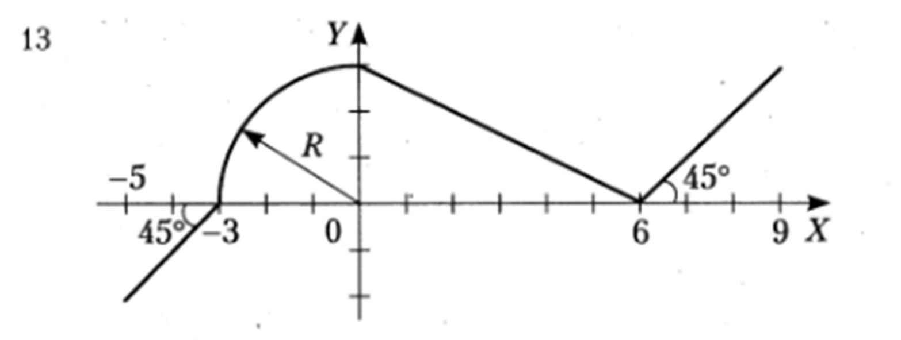

# Семинар 4: *Уникальная* таска от Коренькова
## В чём суть?
В папке 'resourses' лежит pdf с вариантами заданий.

Мне достался 13ый:

Нужно реализовать программу на ассемблере, которая будет принимать на вход X и выдавать на вход Y, согласно графику данной функции.

Всё бы ничего, но X может быть дробным числом...

Разрешено представлять его, как число с фиксированной точкой (а не плавающей).

